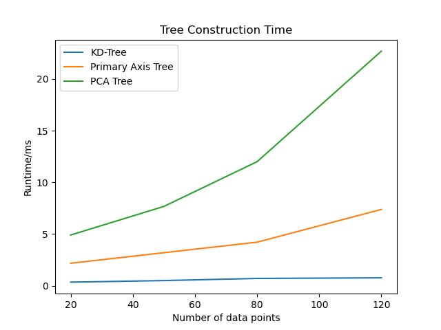
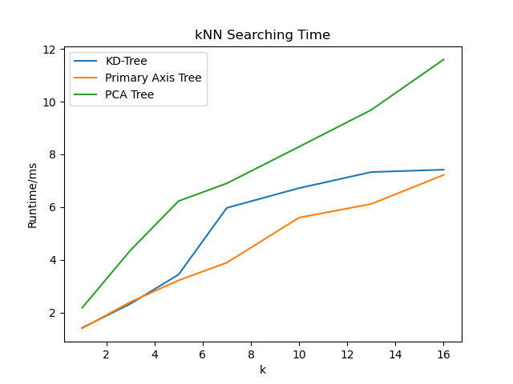
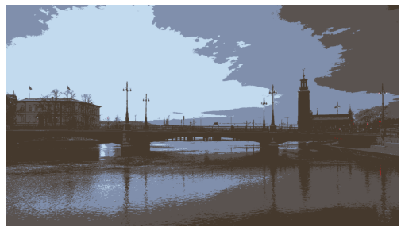

# csci-8442
Computational Geometry and Applications project on tree algorithms for the nearest neighbor problem

## Implemented Algorithms
+ KD-Tree `kd_tree.py`
+ Primary Axis Tree `pa_tree.py`
+ PCA Tree `pca_tree.py`
+ Train and test on a real-world dataset (the Iris dataset) `train_test.ipynb`

## Demo

### Segmentation
Before segmentation

After segmentation with nearest neighbor search in the color space

